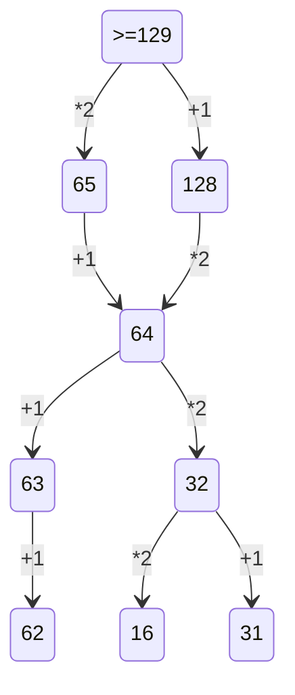

# 1 задача
1) найти точки, через который проходят пути между пунктами
2) найти все возможные варианты путей и посчитать их сумму
3) сложить ответы

# 2 задача(программируемая)
1) написать программу наподобие той, что в файле 2.py в папке ege
2) перетасовать результаты под таблицу

# 3 задача
1) применить фильтры по нужным значкениям
2) посчитать и умножить(при необходимости) на нужное количество

# 4 задача
> важно помнить про прямое условие фано - код одного символа не может быть началом кода другого символа
1) посмотреть, сколько раз встречается каждая буква
2) на основе данных условия задать для буквы, повторяющейся наибольшее количество раз, код с минимальным количеством знаков
3) далее по бинарному дереву выстроить значения для других букв
- пример бинарного дерева("*"для отделения):
~~~mermaid
stateDiagram-v2
    0--> 0*
    0 --> 1
~~~

# 5 задача(программируемая)
1) в python для записи бинарного вида числа используется функция bin()
2) пишем в цикле все условия задачи(подробно в 5.py в папке ege)

# 6 задача(программируемая)
> данное решение может быть неактуально для других типов этой задачи
1) на python нужно нарисовать то, что хадано циклом, после чего(в данном случае) можно с помощью циклов расставить точки на рисунке и посчитать те, что оказались внутри фигуры
2) на кумире достаточно просто нарисовать фигуру, выставить масштаб таблицы 1:1 и посчитать пересечения линий клеток внутри фигуры

# 7 задача
1) вспомнить формулу для вычисления нужной величины
2) написать формулы для случаев "до" и "после"
3) определить изменение данной велимчины и получить то, что требуется

# 8 задача (программируемая)
1) генерируем все возможные варианты чисел(for, product)
2)проверяем строчку на условия; 
3)выводим счетчик значения.

# 9 задача
> данную задачу можно сделать и в python, но в таблице легче
1) обозначить выполнение 1 условия
2) обозначить остальные условия на основе 1-го
3) посчитать одновременно удовлетворяющие обоим условиям клетки

# 10 задача
1) Ctrl + F в параметрах ставим галочки "учитывать регистр" + "только слово целиком"
2) количество результатов будет показываться

# 13 задача 

накопительно нумеруем вершины графа, суммируем либо умножаем варианты

# 19 задача
1) Нужно определить точку вход, условие ваыугрыша, сколько очков нужно наблать, чтобы завершить игру.
2) Рассписать двоичное дерево на 4 хода.
3) Ответить на вопрос задачи, присвоив какой ход, кто совершает.

# 20 задача
1) найти точку входа(№1 в #19)
2) разыграть все сценарии при которых выполняются условия задачи

~~~ mermaid
stateDiagram-v2
    129 --> 65:П(*2)
    129 --> 128:П(+1)
    128 --> 64:В(*2)
    128--> 127:В(+1)
    64 --> 63:П(+1)
    64 --> 32:П(*2)
    63 --> ответ
    32 --> ответ
    127 --> 126:П(+1)
~~~

# 21 задача
1) выполнить 2 первых пункта #19
2) разыграть все возможные сценарии, при которых выполняются условия задачи(в данном случае нужно записать минимальное значение)

~~~mermaid
stateDiagram-v2
    129 --> 128:В(+1)
    129 --> 65:В(*2)
    128 --> 127:П(+1)
    127 --> 126:В(+1)
    128 --> 64:П(*2)
    65 --> 64:П(+1)
    64 --> 32:В(*2)
    64 --> 63:В(+1)
    63 --> 62:П(+1)
    32 --> 16:П(*2)
    32 --> 31:П(+1)
    126 --> 63*:П(*2)
    126 --> 125:П(*2)
~~~

| Номер задачи | её готовность |
| ------ | ------ |
| 1 | 58 |
| 2 | 45 |
| 3 | + |
| 4 | 14 |
| 5 | - |
| 6| - |
| 7 |- |
| 8 |- |
| 9 |- |
| 10 |- |
| 11 |- |
| 12 |- |
| 13 |- |
| 14 |- |
| 15 |- |
| 16 |- |
| 17 |- |
| 18 |- |
| 19 | 64 |
| 20 | 32, 63 |
| 21 | 62 |

