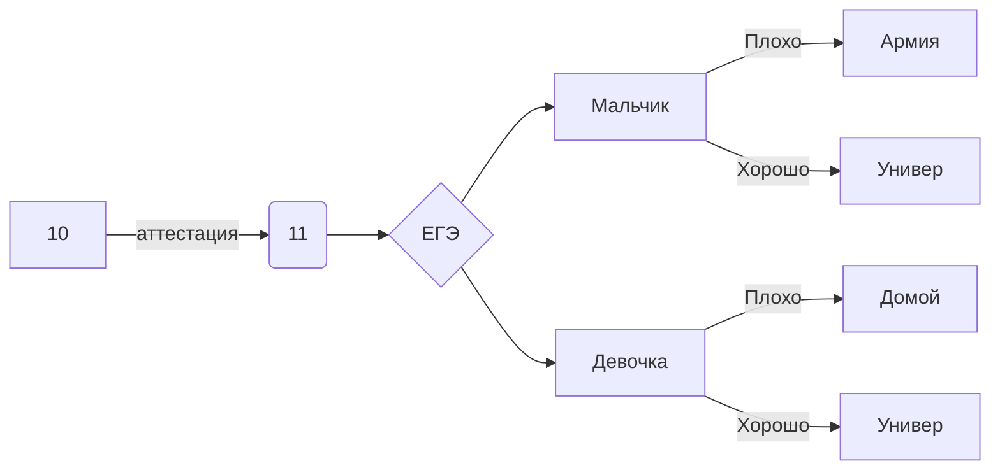

Вайс Максим 122 а
https://openprocessing.org/user/344082?view=activity&o=1#topPanel

1) папка graph- домашнее задание по работе с черепахой в Python
2) pip.py в папке turtle- черепаха(дерево)
3) база данных.py - работа с базой данных в Python
4) hemming.ipynb - работа с кодом Хемминга 
5) лог операции.xlsx - таблица с логическими операциями в Excel 
6) Книга1.xlsx -
1)Таблица умножения 
2)возведение двойки в степень 
3),4) задачи
7) Книга2.xlsx 
1) перевод из десятичной системы счисления в двоичную; 
2)работа с фильтрами;
3)перевод в другую систему счисления с условием; 
4)Азбука Морзе в Excel; 
5)таблица умножения 8ричной системы
8) ege.py - егэшная задача 
9) https://loki478.wordpress.com/ - сайт на wordpress 
10) нейронка.png - фото нейронки 
11) https://codepen.io/weissok - codepen
12) SQL.txt - SQL файл

13) Законы логики 16 формула (Закон де Моргана):
$$\overline{A \vee_{}^{} B} = \overline{A} \ \wedge_{}^{}\overline{B}$$

14) какая-то формула:

$$\bar{E_{0}^{2}}=\sqrt{\frac{Fa_{0}^{2}}{\left( x-1 \right)x}} + \alpha\mathrm{}_{1}^{2} + \beta\mathrm{}_{1}^{2}$$

15) кодирование3.py - универсальный решатель
16)slide.py - слайд шоу

17) викторина.py - Викторина

18)Веточка в Inkscape

19)Конструкции.py - конструкции 
| Задание | Ответ, статус |
| ------ | ------ |
| 1 | 53 |
| 2 | Решено |
| 3 |  |
| 4 | 14 |
| 5 |  |
| 6 |  |
| 7 |  |
| 8 |  |
| 9 |  |
| 10 | 45 |
| 11 |  |
| 12 |  |
| 13 |  |
| 14 |  |
| 15 |  |
| 16 |  |
| 17 | |
| 18 |  |
| 19 |  |
| 20 |  |
| 21 |  |

